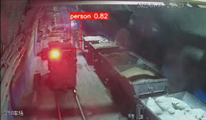
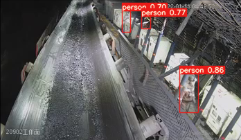
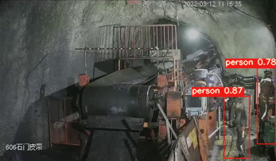

# Rep-YOLO

Implementation of paper - Rep-YOLO: an efficient detection method for mine personnel






# Requirements
```
$ pip install -r requirements.txt
```


# Training
Run commands below to reproduce results on Mine Personnel (MP) dataset
```
$ python train.py --data data\Rep-YOLO_MPdataset.yaml --cfg cfg\training\Rep-YOLO.yaml --weights '' --batch-size 8
```

# Testing
```
$ python test.py
```

# Inference
`detect.py` runs inference on coal mine source
```
$ python detect.py
```


